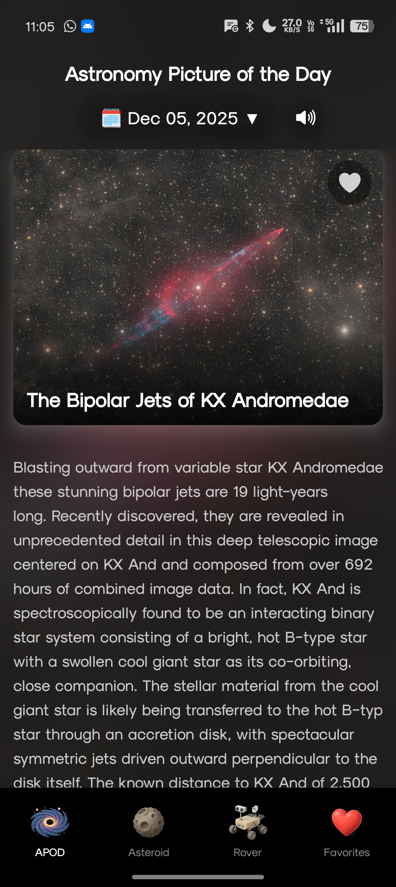
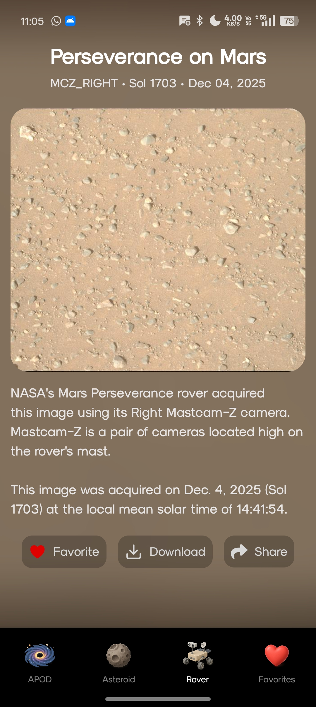
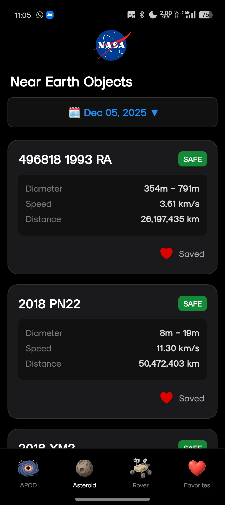
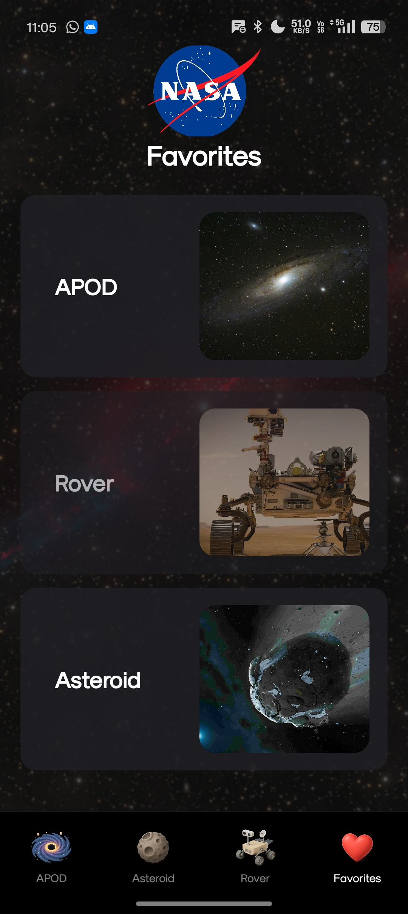

🌌 NASA Explorer App
A React Native app built with Expo, using 100% free NASA APIs to display space images, Mars rover photos, and asteroid data.
This project focuses on clean UI, real-time API integration, and a smooth, user-friendly experience.

🚀 Features:
🌠 Astronomy Picture of the Day (APOD)
🤖 Mars Rover Photos (Perseverance)
🔄 Horizontal Rover Image Scrolling for smooth browsing
☄️ Asteroid Tracker using NASA NeoWs API
🌙 Dark theme UI for a premium space look
🧭 Easy navigation and simple user flow

🛠️ Tech Stack:
• React Native
• Expo
• NASA Open APIs
• Fetch API for network calls

🖼️ Screenshots:

### Astronomy Picture of the Day (APOD)

### Mars Rover Image Scrolling

### Asteroid Tracker

### Favorites Screen

📦 Installation:

# Clone the repo
git clone https://github.com/TeZLa369/NASA-API.git

# Go into project folder
cd NASA-API

# Install dependencies
npm install

# Start the project
npx expo start

🌐 Live Demo:
Coming Soon (Expo Web + Vercel Deployment in Progress 🚀)
